# Mermaid Workflow Diagrams
# These diagrams can be rendered in GitHub/GitLab Markdown

## Branching Strategy

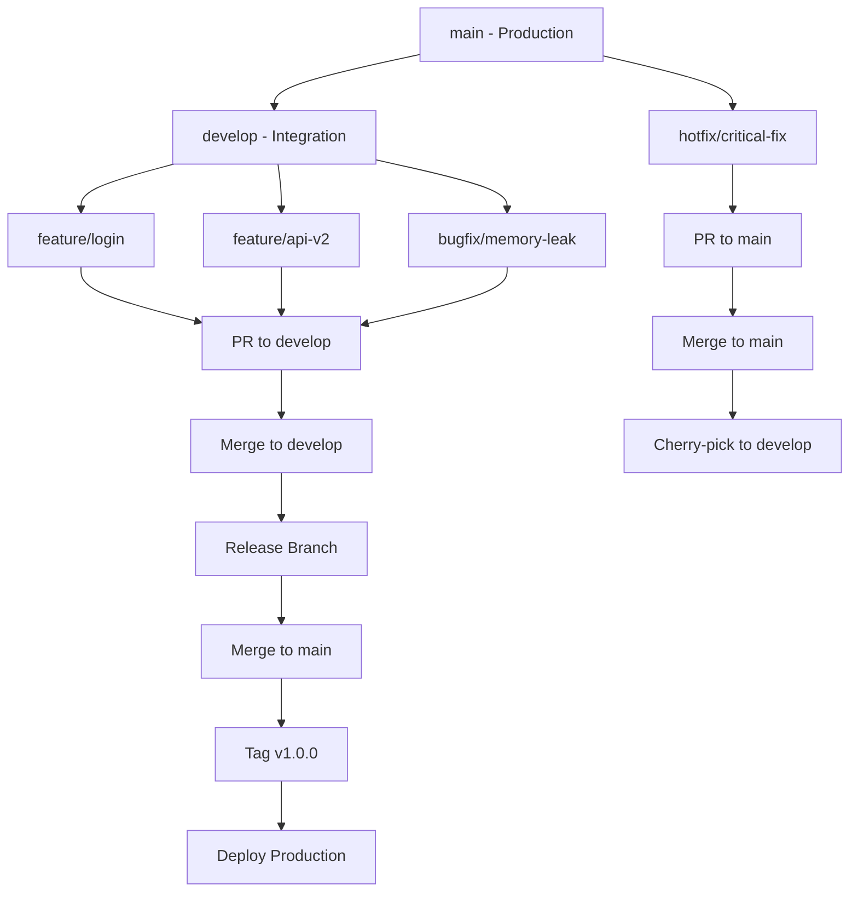

## PR Lifecycle

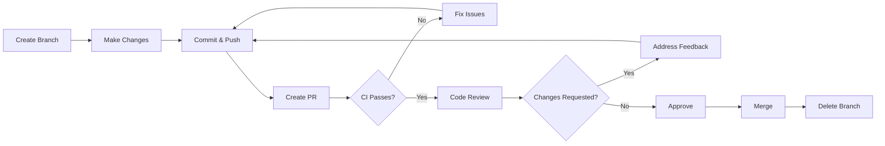

## CI/CD Pipeline

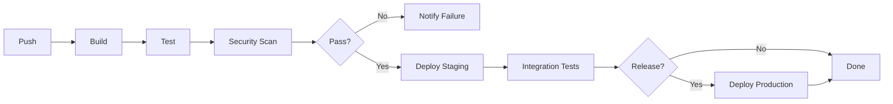

## Issue Lifecycle

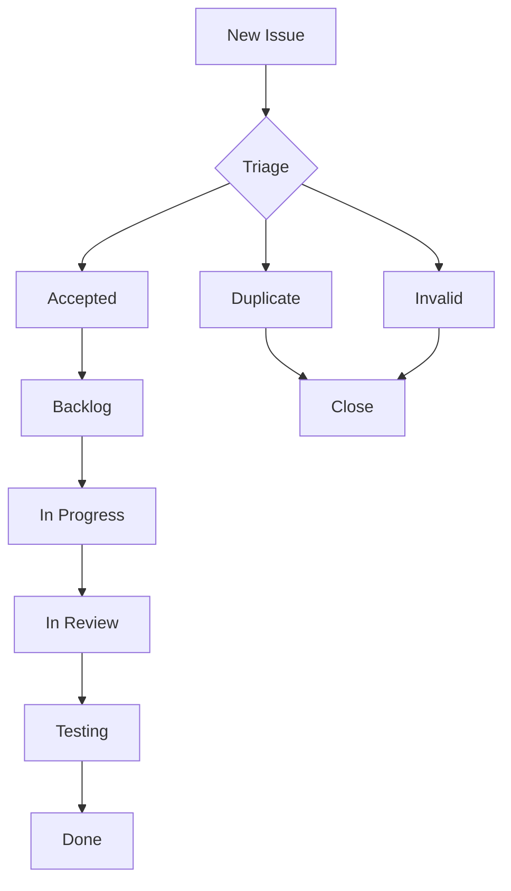

## Git Operations Flow

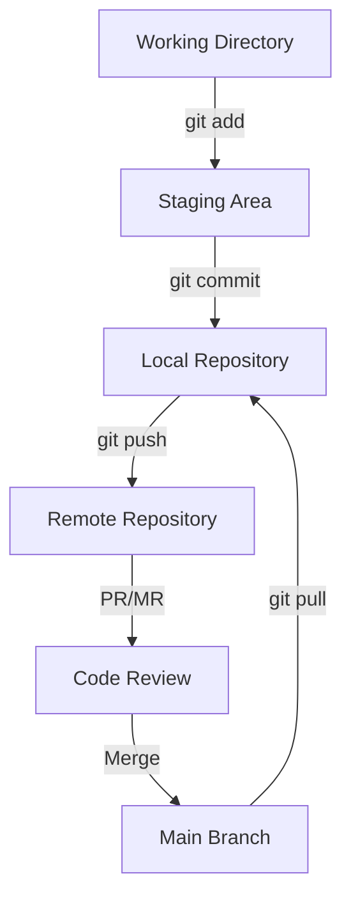

## Release Process

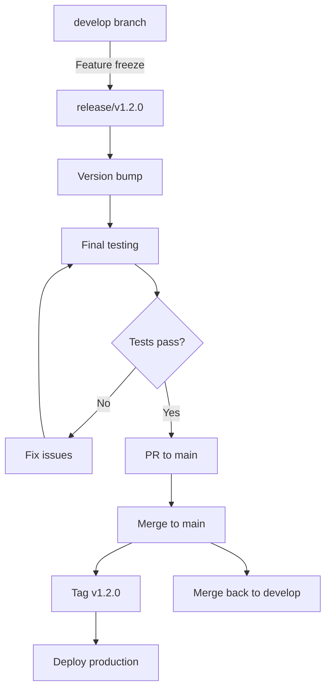

## Platform Sync

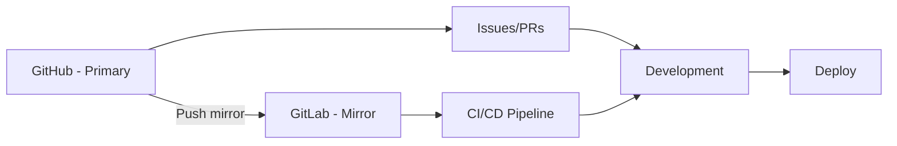

## Conventional Commits

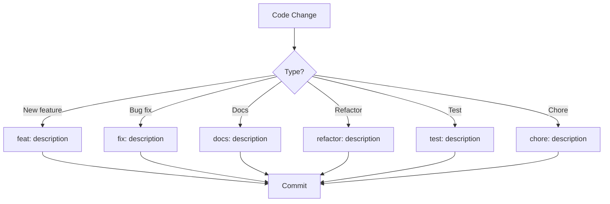

## Fork Workflow

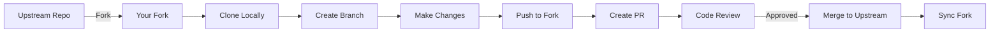

## Hotfix Process

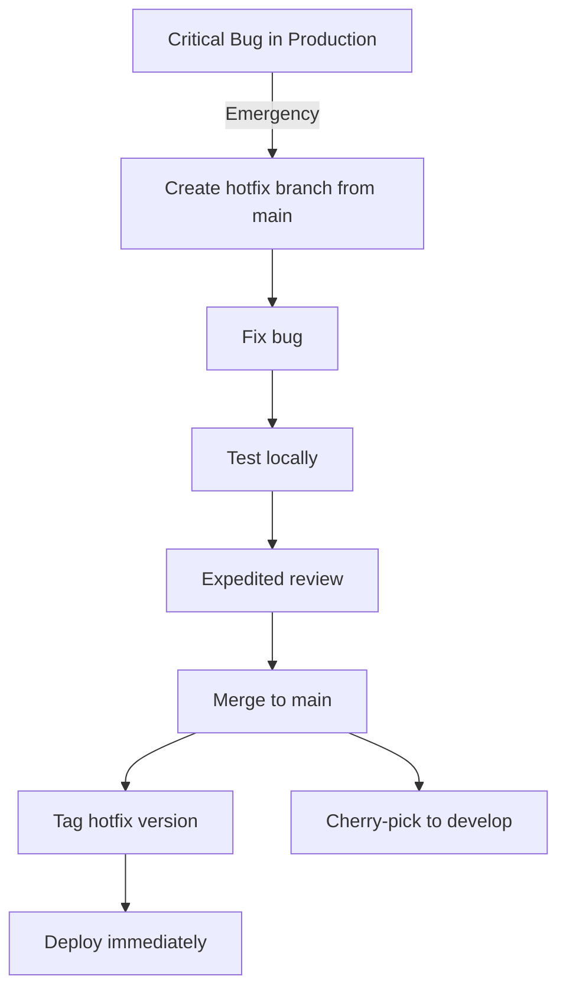

## Stash Workflow

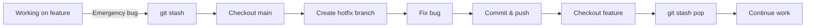

---

## Usage

These diagrams can be included in Markdown files:

```markdown
```mermaid
[diagram code]
```
```

GitHub and GitLab both render Mermaid diagrams in:
- Issue descriptions
- Pull/Merge request descriptions
- Wiki pages
- Markdown files
